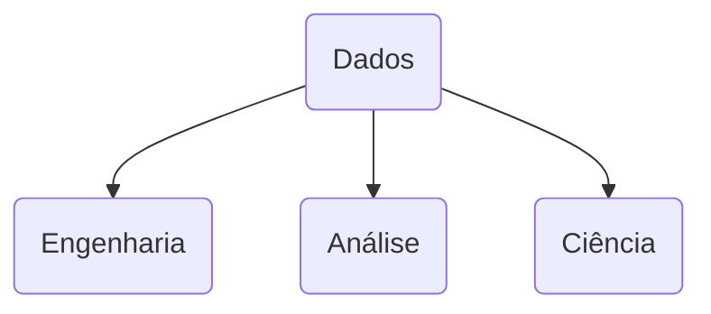

# Repositório Global de Referências em Dados 🎲🎲
**DISCLAIMER:** _Esse post foi criado inspirado no post de_ [✨FRONT-END✨](https://www.tabnews.com.br/MatheusManuel/5-sites-para-treinar-o-front-end) _do [Matheus Manuel](https://github.com/matheusmanuel)_

---

## Objetivo
Esse post tem objetivo de servir como repositório de referências em Dados em geral! Seja pra alguém que esteja começando, quanto pra alguém já tem alguns kms rodados! 
🚨 **Atenção! Estamos aqui pra aprender e crescer a comunidade juntos!** 🚨
**A ideia aqui é fazer um post compartilhado, quaisquer referências são bem-vindas!**

## Sobre o autor do post 
Olá! Me chamo João Tedeschi e trabalho com dados desde 2017 e desde então sou apaixonado pelo tema. Desde criar queries em SQL, criar modelos de machine learning até subir datalakes na nuvem!

> Quem quiser se conectar pra trocar uma ideia sobre carreira, conceitos,tecnologias, projetos ou até mesmo parcerias! segue os contatos:

  

# Dados! Dados! Dados!
Atualmente, essa frente da tecnologia é bem visada, apesar de já existir 

## Carreiras em Dados
Claro que temos diversas nomenclaturas para as funções que o pessoal desempenha em dados, mas eu resolvi dividi-las em três caixas: 

Todas essas caixas tem interfaces entre si. 